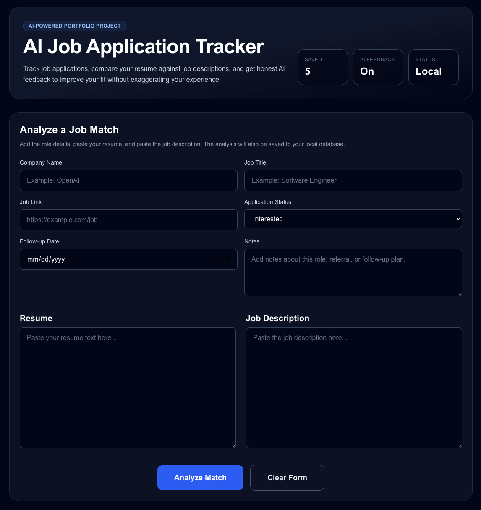
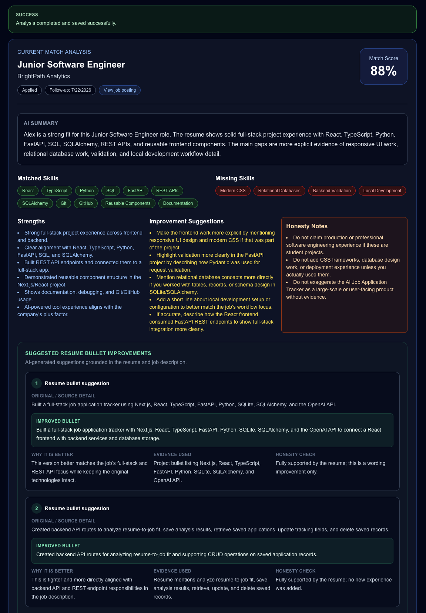
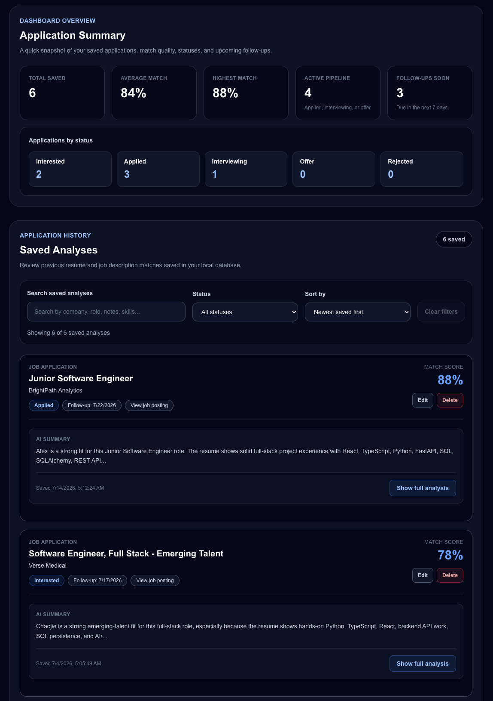
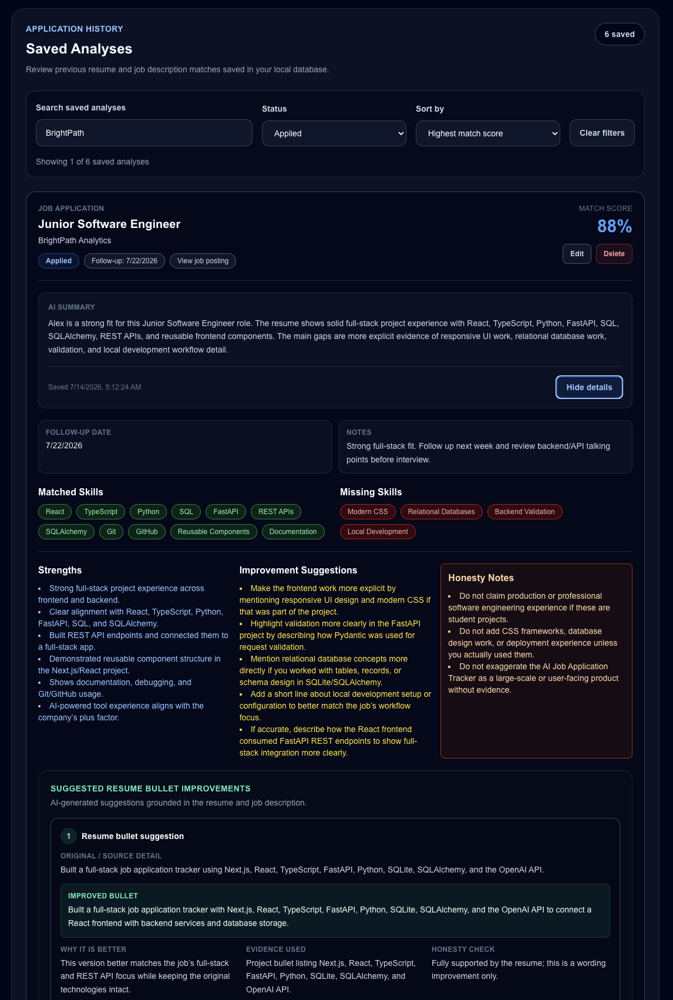

# AI Job Application Tracker

A full-stack AI-powered job application tracker that helps users compare their resume against job descriptions, review AI-generated fit feedback, and organize saved job applications in one place.

This project was built as a portfolio project to practice full-stack development, AI integration, API design, database persistence, and frontend state management. The goal is to support a realistic job-search workflow while keeping the resume feedback honest and grounded in the user's existing experience.

## Features

- Analyze a resume against a job description using AI
- Generate a resume-to-job match score
- Identify matched skills and missing skills
- Provide AI-generated strengths, improvement suggestions, and honesty notes
- Suggest resume bullet improvements without inventing fake experience
- Save job applications with company, role, job link, status, notes, and follow-up date
- View saved applications in a searchable and filterable dashboard
- Sort saved applications by date, match score, company, role, or follow-up date
- Edit saved applications and update tracking fields
- Delete saved applications
- Collapse and expand saved analysis details
- View dashboard summary stats, including total applications, average match score, highest match score, active pipeline count, follow-ups due soon, and status breakdown

## Tech Stack

### Frontend
- Next.js
- React
- TypeScript
- Tailwind CSS

### Backend
- FastAPI
- Python
- Pydantic
- SQLAlchemy

### Database
- SQLite for local persistence

### AI Integration
- OpenAI Python SDK
- Structured AI output for consistent resume/job match results

### Configuration
- Environment variables for local and deployment-ready configuration
- Example environment files included for setup guidance

## Project Structure

```text
AI Job Tracker/
├── backend/
│   ├── app/
│   │   ├── ai_service.py      # OpenAI-powered resume/job analysis logic
│   │   ├── database.py        # SQLAlchemy database connection and session setup
│   │   ├── main.py            # FastAPI app, routes, and API schemas
│   │   └── models.py          # SQLAlchemy database models
│   ├── .env.example           # Example backend environment variables
│   └── requirements.txt       # Backend Python dependencies
│
├── frontend/
│   ├── src/
│   │   ├── app/               # Next.js app entry files
│   │   ├── components/        # Reusable UI components
│   │   └── types/             # Shared TypeScript types
│   ├── .env.local.example     # Example frontend environment variables
│   └── package.json           # Frontend scripts and dependencies
│
└── README.md
```

## Environment Variables

This project uses environment variables for API keys and local configuration. Real environment files are intentionally ignored by Git so secrets are not committed.

### Backend

Create a real backend environment file from the example file:

```bash
cp backend/.env.example backend/.env
```

Then update `backend/.env` with your local values:

```env
OPENAI_API_KEY=your_openai_api_key_here
OPENAI_MODEL=gpt-5.4-mini
FRONTEND_ORIGIN=http://localhost:3000
```

### Frontend

Create a real frontend environment file from the example file:

```bash
cp frontend/.env.local.example frontend/.env.local
```

The local frontend API base URL should point to the FastAPI backend:

```env
NEXT_PUBLIC_API_BASE_URL=http://127.0.0.1:8000
```

## Local Setup

### Backend Setup

From the project root:

```bash
cd backend
conda activate ai-job-tracker-backend
pip install -r requirements.txt
uvicorn app.main:app --reload
```

The backend runs at:

```text
http://127.0.0.1:8000
```

You can check the backend health route at:

```text
http://127.0.0.1:8000/health
```

### Frontend Setup

In a separate terminal, from the project root:

```bash
cd frontend
npm install
npm run dev
```

The frontend runs at:

```text
http://localhost:3000
```

### Frontend Checks

Run linting:

```bash
cd frontend
npm run lint
```

Run a production build check:

```bash
cd frontend
npm run build
```

## API Routes

| Method | Route | Description |
| --- | --- | --- |
| `GET` | `/health` | Checks whether the backend is running |
| `POST` | `/analyze` | Analyzes a resume against a job description and saves the result |
| `GET` | `/analyses` | Returns saved job analyses |
| `PUT` | `/analyses/{analysis_id}` | Updates a saved analysis |
| `DELETE` | `/analyses/{analysis_id}` | Deletes a saved analysis |

## Screenshots / Demo

### Main Input Form

The main form collects job tracking details, notes, resume text, and the job description before running the AI-powered match analysis.



### AI Match Analysis Result

After submitting the form, the app returns a structured match analysis with a match score, AI summary, matched skills, missing skills, strengths, improvement suggestions, honesty notes, and resume bullet feedback.



### Saved Applications Dashboard

Saved analyses are persisted locally and shown in a dashboard with summary stats, application status counts, match scores, follow-up dates, and saved application cards.



### Search, Filter, Sort, and Expanded Analysis

Saved analyses can be searched, filtered by status, sorted by match score or date, and expanded to review the full AI-generated feedback.



## What I Learned

While building this project, I practiced:

- Designing a full-stack app with a separate frontend and backend
- Creating REST API routes with FastAPI
- Managing frontend state with React and TypeScript
- Building reusable UI components with Tailwind CSS
- Persisting saved application data with SQLite and SQLAlchemy
- Integrating AI output into a structured application workflow
- Using environment variables to separate local configuration from committed code
- Preparing a project for future deployment by removing hardcoded local URLs

## Future Improvements

Potential future improvements include:

- Resume PDF upload and text extraction
- A verified resume fact bank to keep AI suggestions grounded in confirmed user experience
- User authentication and multi-user support
- PostgreSQL or Supabase migration for production persistence
- Deployment of the frontend and backend
